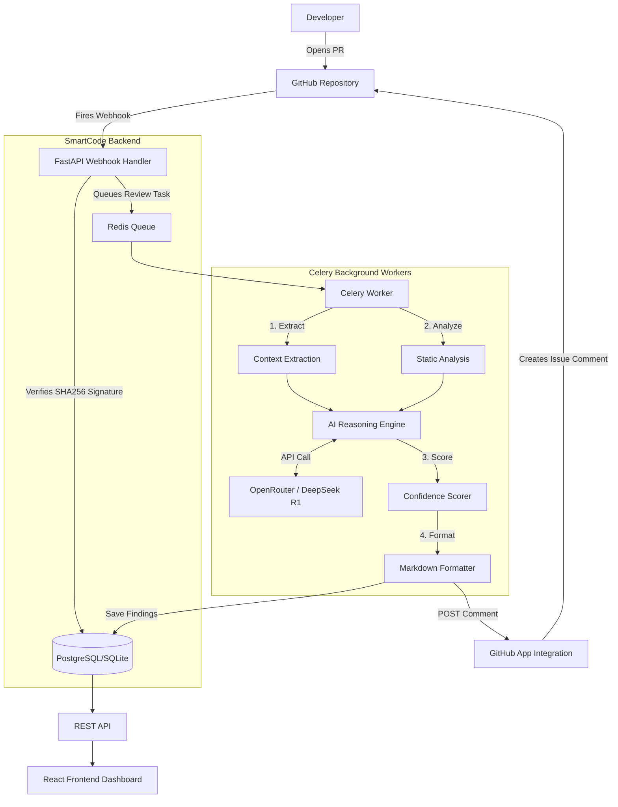

# 🧠 SmartCode Architecture & Design

SmartCode is an AI-powered code review assistant designed to provide deep, contextual feedback on Pull Requests, focusing on intent, requirement alignment, and code safety rather than just syntax and formatting.

---

## 🚨 The Problem Statement

**Code reviews are the biggest bottleneck in software delivery.**

Traditional teams face several critical challenges when reviewing Pull Requests (PRs):
1. **Time Delays**: The average PR waits 24+ hours for a human review, blocking developer momentum.
2. **Inconsistent Quality**: Review depth depends entirely on the reviewer's availability, mood, and domain expertise.
3. **Superficial Feedback**: Existing automated tools (linters, CodeQL, SonarQube) catch syntax errors, formatting issues, or known CVE patterns, but they miss the most important question: 
   > *"Does this PR actually implement what the linked issue requested, and is it safe to merge?"*

Developers need an automated system that can reason about code changes the same way a Senior Staff Engineer would—checking for requirement drift, performance bottlenecks, and architectural consistency.

---

## 💡 The Solution

**SmartCode** is an AI-powered GitHub App that automatically reviews Pull Requests by understanding the intent behind the code. 

Instead of just checking for missing semicolons, SmartCode analyzes the code diff alongside the linked issue context to generate a **PR Approval Confidence Score (0-100)**. This score tells the team exactly how safe it is to merge the PR.

### Core Capabilities
- **Requirement Alignment**: Verifies if the code changes actually fulfill the requirements outlined in the linked issue.
- **Security Safety**: Scans for vulnerabilities, injection risks, and insecure data handling.
- **Code Quality & Tech Debt**: Evaluates cyclomatic complexity, anti-patterns, and long-term maintainability.
- **Automated PR Commenting**: Posts a structured, markdown-formatted review directly on the GitHub PR within seconds of it being opened.

---

## 🏗️ Architecture

SmartCode is built using an asynchronous, event-driven architecture designed to handle GitHub webhooks quickly without timing out.

### High-Level System Design

### Component Breakdown

1. **GitHub App webhook receiver (`routes/webhook.py`)** 
   - Receives massive JSON payloads from GitHub when a PR is opened or updated.
   - Securely verifies the payload using HMAC SHA-256 to ensure it authenticates correctly.
   - Responds immediately with a `200 OK` to prevent GitHub from dropping the connection.
   - Pushes the PR details onto a Redis queue for asynchronous processing.

2. **Celery Worker Engine (`worker.py`)**
   - Picks up the pending PR analysis jobs from the Redis queue.
   - Uses `PyGithub` to fetch the raw code diffs, repository context, and linked issues.
   
3. **AI Reasoning Engine (`analysis_engine/llm_reviewer.py`)**
   - The core intelligence of the system.
   - Packages the code diffs and metadata into highly structured prompt templates.
   - Communicates with **DeepSeek R1** (via OpenRouter) to evaluate the code across 4 dimensions: *Requirements, Security, Performance, and Code Quality*.

4. **Metrics Calculator (`analysis_engine/metrics_calculator.py`)**
   - Takes the raw findings from the LLM and calculates objective metrics, such as the `Bug Risk Score` and the `Technical Debt Indicator`.
   - Generates the final 0-100 `Confidence Score` to determine the verdict (APPROVE vs REVIEW_NEEDED).
   
5. **Frontend Dashboard (`frontend/`)**
   - A React 18 / TypeScript interface built with Tailwind CSS and Shadcn UI.
   - Interfaces with the Fast API backend (`routes/api.py`) to provide teams with historical metrics, repository health tracking, and detailed graphical representations of how well their codebase is scoring over time.

### Technology Stack
- **Backend**: Python 3.11+, FastAPI, Celery
- **Database**: PostgreSQL 15+ (SQLite for local dev)
- **Message Broker**: Redis 7+
- **AI / LLM**: OpenRouter (DeepSeek R1)
- **Frontend**: React 18, TypeScript, Vite, TailwindCSS, Shadcn UI
- **Integration**: GitHub Apps SDK (`PyGithub`)
