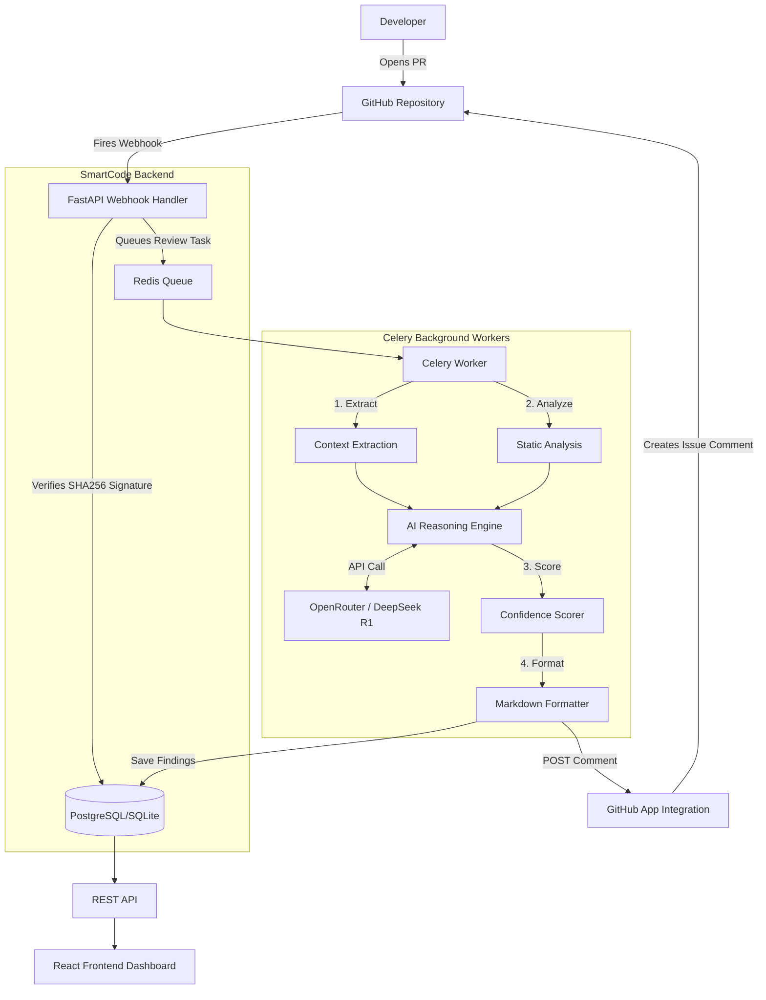

<div align="center">
  <h1>🧠 SmartCode</h1>
  <p><strong>AI-powered code review that understands intent, not just syntax.</strong></p>
  <p>
    <a href="#-the-problem">Problem</a> •
    <a href="#-the-solution">Solution</a> •
    <a href="#-architecture--working">Architecture & Working</a> •
    <a href="#-deliverables">Deliverables</a> •
    <a href="#-quick-start--setup">Setup</a>
  </p>
  <p>
    
    
    
    
    
  </p>
</div>

---

## 🚨 The Problem

**Code reviews are the biggest bottleneck in software delivery.**

Traditional teams face several critical challenges when reviewing Pull Requests (PRs):
1. **Time Delays**: The average PR waits 24+ hours for a human review, blocking developer momentum.
2. **Inconsistent Quality**: Review depth depends entirely on the reviewer's availability, mood, and domain expertise.
3. **Superficial Feedback**: Existing automated tools (linters, CodeQL, SonarQube) catch syntax errors, formatting issues, or known CVE patterns, but they miss the most important question: 
   > *"Does this PR actually implement what the linked issue requested, and is it safe to merge?"*

Developers need an automated system that can reason about code changes the same way a Senior Staff Engineer would—checking for requirement drift, performance bottlenecks, and architectural consistency.

---

## 💡 The Solution

**SmartCode** is an AI-powered GitHub App that automatically reviews Pull Requests by understanding the intent behind the code. 

Instead of just checking for missing semicolons, SmartCode analyzes the code diff alongside the linked issue context to generate a **PR Approval Confidence Score (0-100)**. This score tells the team exactly how safe it is to merge the PR.

### Core Capabilities
- **Requirement Alignment**: Verifies if the code changes actually fulfill the requirements outlined in the linked issue.
- **Security Safety**: Scans for vulnerabilities, injection risks, and insecure data handling.
- **Code Quality & Tech Debt**: Evaluates cyclomatic complexity, anti-patterns, and long-term maintainability.
- **Automated PR Commenting**: Posts a structured, markdown-formatted review directly on the GitHub PR within seconds of it being opened.

---

## 🏗️ Architecture & Working

SmartCode is built using an asynchronous, event-driven architecture designed to handle GitHub webhooks quickly without timing out.

### High-Level System Design



### How It Works (Component Breakdown)

1. **GitHub App Webhook Receiver (`routes/webhook.py`)** 
   - Receives massive JSON payloads from GitHub when a PR is opened or updated.
   - Securely verifies the payload using HMAC SHA-256 to ensure it authenticates correctly.
   - Responds immediately with a `200 OK` to prevent GitHub from dropping the connection.
   - Pushes the PR details onto a Redis queue for asynchronous processing.

2. **Celery Worker Engine (`worker.py`)**
   - Picks up the pending PR analysis jobs from the Redis queue.
   - Uses `PyGithub` to fetch the raw code diffs, repository context, and linked issues.
   
3. **AI Reasoning Engine (`analysis_engine/llm_reviewer.py`)**
   - The core intelligence of the system.
   - Packages the code diffs and metadata into highly structured prompt templates.
   - Communicates with **DeepSeek R1** (via OpenRouter) to evaluate the code across 4 dimensions: *Requirements, Security, Performance, and Code Quality*.

4. **Metrics Calculator (`analysis_engine/metrics_calculator.py`)**
   - Takes the raw findings from the LLM and calculates objective metrics, such as the `Bug Risk Score` and the `Technical Debt Indicator`.
   - Generates the final 0-100 `Confidence Score` to determine the verdict (`APPROVE` vs `REVIEW_NEEDED`).
   
5. **Frontend Dashboard (`frontend/`)**
   - A React 18 / TypeScript interface built with Tailwind CSS and Shadcn UI.
   - Interfaces with the FastAPI backend (`routes/api.py`) to provide teams with historical metrics, repository health tracking, and detailed graphical representations of how well their codebase is scoring over time.

---

## 📦 Deliverables

This project includes the following primary deliverables:

1. **The SmartCode GitHub App Integration**: The core webhook payload processor and PR commenter integrated directly with GitHub using the `PyGithub` SDK.
2. **The Asynchronous AI Backend**: A FastAPI + Celery architecture that queues webhook triggers and processes large code diffs asynchronously using DeepSeek R1.
3. **The AI Evaluation Engine**: A robust set of Python modules that extract requirements from GitHub Issues and evaluates Pull Request diffs against those specific requirements.
4. **The Metrics API & Database Schema**: A PostgreSQL/SQLite data layer that securely stores historic PR findings, scores, and telemetry data.
5. **The SmartCode Dashboard**: A full-stack React frontend for developers and managers to visualize their repository's code quality and bug risk trends over time.

---

## 🚀 Quick Start & Setup

### Prerequisites
- Python 3.11+
- Node.js 18+ (for frontend)
- Local Redis Server (for Celery workers)
- A GitHub App registered in your developer settings.

### 1. Local Development Backend

```bash
# Clone the repository
git clone https://github.com/riyaa1611/SmartCode_Demo.git
cd SmartCode_Demo

# Create virtual environment
python -m venv .venv

# Activate on Windows
.venv\Scripts\Activate.ps1
# OR activate on macOS/Linux
# source .venv/bin/activate

# Install dependencies
pip install -r requirements.txt

# Configure environment
cp .env.example .env
# Edit .env with your:
# - OPENROUTER_API_KEY
# - GITHUB_APP_ID
# - GITHUB_PRIVATE_KEY
# - GITHUB_WEBHOOK_SECRET

# Initialize the database (SQLite for local dev)
python init_db.py

# Run the FastAPI server
uvicorn main:app --host 127.0.0.1 --port 8084 --reload
```

### 2. Run the Celery Worker
In a separate terminal window (with the `.venv` activated):
```bash
# Windows
celery -A worker.celery_app worker --pool=solo -l info

# Linux/macOS
celery -A worker.celery_app worker --loglevel=info
```

### 3. Frontend Dashboard Development
In a new terminal window:
```bash
cd frontend
npm install
npm run dev
```

### 4. GitHub Webhook Tunneling (ngrok)
To receive webhooks from GitHub on your local machine:
```bash
ngrok http 8084
```
*Copy the `https://<id>.ngrok-free.app` URL and set it as your webhook URL in your GitHub App settings.*

---

## 🤝 Contributing

1. Fork the repository
2. Create a feature branch: `git checkout -b feature/your-feature`
3. Commit your changes: `git commit -m "Add your feature"`
4. Push to the branch: `git push origin feature/your-feature`
5. Open a Pull Request

---

## 📄 License

MIT License — see [LICENSE](LICENSE) for details.